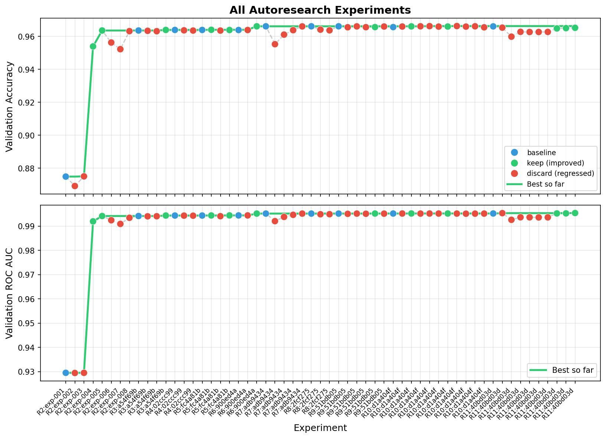

# Airline Passenger Satisfaction Prediction

## Overview
This project aims to predict airline passenger satisfaction (classified as either 'satisfied' or 'neutral/dissatisfied') using the [Airline Passenger Satisfaction dataset](https://www.kaggle.com/datasets/teejmahal20/airline-passenger-satisfaction) from Kaggle. 

The primary objective of this repository is to build and evaluate predictive models entirely in Python, with the ultimate success criteria being the implementation of an autoresearch agent designed specifically to outperform manually tuned baseline machine learning models.

## Project Structure
Below is a description of the core directories and configuration files in this repository:

- `data/raw/`: Raw Kaggle source files kept as the original download reference.
- `data/`: The working train/test data used by this project after resplitting for reproducibility and consistent experiments.
- `scripts/`: Supporting notebook-style workflow for the data split and baseline modeling work that established the initial benchmark.
- `model.py`: The current editable autoresearch model definition used for customer satisfaction prediction.
- `prepare.py`: Shared experiment utilities for loading data, creating the validation split, evaluating models, logging results, and plotting performance.
- `run.py`: Runs a single labeled autoresearch experiment against the current `model.py`.
- `demo.py`: Runs the multi-iteration autoresearch demonstration loop and writes the latest run to `results.tsv`.
- `program.md`: The high-level instructions and constraints for the autoresearch workflow.
- `results.tsv`: The latest run-level experiment log used to generate the current performance plot.
- `performance.png`: Best model from each autoresearch run.
- `performance_all_models.png`: All logged autoresearch experiments across runs.

## Errors Encountered

- May 9, 2026: Five weeks into the project, we realized that the autoresearch agent was not actually using both of the resplit `test.csv` and `train.csv` files. Instead, it was only using `train.csv` and then creating a new 80/20 train/validation split from that file. Because this was discovered so late, we will continue the project using 80% of the available resplit data for the sake of consistency across the experiment log.
- May 9, 2026: During Run 6, a cross-validated `HistGradientBoostingClassifier` attempt failed before logging a result because scikit-learn/joblib hit a Windows `PermissionError: [WinError 5] Access is denied` while creating internal worker pipes. The failed attempt was not counted as a completed experiment row, and the run continued with cross-validated random forest tuning inside `model.py`.

## Experiment Log

Track the performance of manual baseline models against the automated research runs below. We use `ROC AUC` as the primary model-selection metric throughout autoresearch; `accuracy` is included as a secondary metric for easier side-by-side viewing.

| Model Type | Creator (User / Autoresearch) | Autoresearch Run # | Runtime (s) | ROC AUC | Accuracy | Preserved/Deleted | Notes |
| :--- | :--- | :--- | :--- | :--- | :--- | :--- | :--- |
| Logistic Regression | User | | 3.2949 seconds |0.9197 | NA* | Preserved | Baseline with minimal preprocessing. Max iterations set to 1000. |
| Logistic Regression | Autoresearch |2| 0.24 seconds |0.9295 | 0.8748 | Preserved | 8-iteration run exp-001 baseline from `demo.py`. |
| Logistic Regression Balanced | Autoresearch |2| 0.24 seconds |0.9294 | 0.8691 | Deleted | 8-iteration run exp-002 discarded. `class_weight='balanced'` slightly reduced ROC AUC. |
| Logistic Regression C=0.5 | Autoresearch |2|0.23 seconds |0.9295 | 0.8749 | Deleted | 8-iteration run exp-003 discarded. Essentially tied baseline on ROC AUC. |
| Random Forest | Autoresearch |2|15.27 seconds |0.9920 | 0.9539 | Preserved | 8-iteration run exp-004 kept. `n_estimators=300`, `max_depth=12`, `min_samples_leaf=2`, `n_jobs=1`. |
| Random Forest Full Depth | Autoresearch |2|30.38 seconds |0.9942 | 0.9636 | Preserved | 8-iteration run exp-005 kept and became best overall. `n_estimators=500`, full depth, single-threaded for sandbox safety. |
| Extra Trees | Autoresearch |2|15.57 seconds |0.9924 | 0.9563 | Deleted | 8-iteration run exp-006 discarded. Strong result but below best random forest. |
| Gradient Boosting | Autoresearch |2|27.41 seconds |0.9909 | 0.9523 | Deleted | 8-iteration run exp-007 discarded. Lower ROC AUC than the current best. |
| Extra Trees Full Depth | Autoresearch |2|27.25 seconds |0.9934 | 0.9632 | Deleted | 8-iteration run exp-008 discarded. Close, but still below exp-005. |
| Random Forest Full Depth | Autoresearch |3|28.58 seconds |0.9942 | 0.9636 | Preserved | 4-iteration run baseline using the previously preserved best `RandomForestClassifier(n_estimators=500, n_jobs=1)`. |
| Random Forest Full Depth + Leaf 2 | Autoresearch |3|26.45 seconds |0.9940 | 0.9634 | Deleted | Iteration 2 discarded. Adding `min_samples_leaf=2` slightly reduced ROC AUC relative to the run baseline. |
| Random Forest Balanced Subsample | Autoresearch |3|32.29 seconds |0.9941 | 0.9632 | Deleted | Iteration 3 discarded. `class_weight='balanced_subsample'` did not beat the baseline ROC AUC. |
| Random Forest Log Loss | Autoresearch |3|28.63 seconds |0.9944 | 0.9640 | Preserved | Iteration 4 kept and became the new best model. Switched the forest criterion to `log_loss`. |
| Random Forest Log Loss | Autoresearch |4|26.97 seconds |0.9944 | 0.9640 | Preserved | 3-iteration run baseline using the current preserved best `RandomForestClassifier(criterion='log_loss', n_estimators=500, n_jobs=1)`. |
| Random Forest + Engineered Aggregate Features | Autoresearch |4|29.48 seconds |0.9943 | 0.9637 | Deleted | Iteration 2 discarded. Added aggregate service and delay features in preprocessing, but ROC AUC stayed below the run baseline. |
| Random Forest + Aggregate Features and Flags | Autoresearch |4|28.19 seconds |0.9943 | 0.9636 | Deleted | Iteration 3 discarded. Added delay and traveler-profile flags on top of engineered aggregates, but still did not beat the baseline ROC AUC. |
| Random Forest Log Loss | Autoresearch |5|27.26 seconds |0.9944 | 0.9640 | Preserved | 4-iteration run baseline using the current preserved best `RandomForestClassifier(criterion='log_loss', n_estimators=500, n_jobs=1)`. |
| Random Forest Log Loss n=800 | Autoresearch |5|45.04 seconds |0.9944 | 0.9641 | Preserved | Iteration 2 kept. Increasing to 800 trees slightly improved ROC AUC and became the new best model. |
| Random Forest n=800 Ordinal Categories | Autoresearch |5|46.89 seconds |0.9941 | 0.9636 | Deleted | Iteration 3 discarded. Replacing one-hot categorical encoding with ordinal encoding reduced ROC AUC. |
| Random Forest Log Loss n=1000 | Autoresearch |5|52.05 seconds |0.9944 | 0.9639 | Preserved | Iteration 4 kept and became the new best model. Increasing to 1000 trees slightly improved ROC AUC over the 800-tree forest. |
| Random Forest Log Loss n=1000 | Autoresearch |6|52.75 seconds |0.9944 | 0.9639 | Preserved | Run 6 baseline using the current best `RandomForestClassifier(criterion='log_loss', n_estimators=1000, n_jobs=1)`. |
| Cross-Validated Random Forest n/ Split Tuning | Autoresearch |6|501.39 seconds |0.9944 | 0.9639 | Deleted | Iteration 2 discarded. `GridSearchCV` tuned `n_estimators` and `min_samples_split`, but the selected model only tied the run baseline. |
| Cross-Validated Random Forest Max Features | Autoresearch |6|6708.60 seconds** |0.9952 | 0.9662 | Preserved | Iteration 3 kept and became the new best model. `GridSearchCV` tuned `max_features` between `'sqrt'` and `0.7` using 3-fold ROC AUC selection inside `model.py`. |
| Cross-Validated Random Forest Max Features | Autoresearch |7|514.07 seconds |0.9952 | 0.9662 | Preserved | Run 7 baseline using the current best `GridSearchCV` random forest tuned over `max_features`. |
| Gradient Boosting lr=0.06 depth=3 | Autoresearch |7|44.64 seconds |0.9921 | 0.9553 | Deleted | Iteration 2 discarded. Tried a single-process `GradientBoostingClassifier` with 450 estimators and subsampling, but it was below the run baseline. |
| Gradient Boosting lr=0.035 depth=4 | Autoresearch |7|77.04 seconds |0.9938 | 0.9611 | Deleted | Iteration 3 discarded. Lower learning rate and deeper trees improved over iteration 2 but still did not beat the baseline ROC AUC. |
| Gradient Boosting lr=0.025 depth=5 | Autoresearch |7|108.85 seconds |0.9947 | 0.9638 | Deleted | Iteration 4 discarded. The strongest gradient boosting variant remained below the cross-validated random forest baseline. |
| Random Forest Log Loss n=1200 max_features=0.7 | Autoresearch |7|155.54 seconds |0.9952 | 0.9661 | Deleted | Iteration 5 discarded. A direct 1200-tree forest nearly tied the baseline but was slightly lower on ROC AUC. |
| Cross-Validated Random Forest Max Features | Autoresearch |8|567.34 seconds |0.9952 | 0.9662 | Preserved | Run 8 baseline using the current best `GridSearchCV` random forest tuned over `max_features`. |
| Cross-Validated Gradient Boosting lr/depth/estimators | Autoresearch |8|1575.20 seconds |0.9949 | 0.9642 | Deleted | Iteration 2 discarded. `GridSearchCV` tuned learning rate, depth, and estimator count for `GradientBoostingClassifier`, but ROC AUC remained below the run baseline. |
| Cross-Validated Gradient Boosting Shrinkage | Autoresearch |8|2210.87 seconds |0.9949 | 0.9637 | Deleted | Iteration 3 discarded. A lower-learning-rate, depth-5 grid slightly improved ROC AUC over iteration 2 but still did not beat the random forest baseline. |
| Cross-Validated Random Forest Max Features | Autoresearch |9|585.10 seconds |0.9952 | 0.9662 | Preserved | Run 9 baseline using the current best `GridSearchCV` random forest tuned over `max_features`; completed just inside the 600-second trial cap. |
| Random Forest n=1000 max_features=0.65 | Autoresearch |9|144.72 seconds |0.9951 | 0.9656 | Deleted | Iteration 2 discarded. Direct single-model trial lowered the CV search cost but reduced ROC AUC below the run baseline. |
| Random Forest n=1100 max_features=0.7 | Autoresearch |9|177.57 seconds |0.9952 | 0.9661 | Deleted | Iteration 3 discarded. A direct forest near the known good `max_features=0.7` setting nearly tied the baseline but did not improve ROC AUC. |
| Random Forest n=1000 max_features=0.75 | Autoresearch |9|165.54 seconds |0.9951 | 0.9656 | Deleted | Iteration 4 discarded. Nudging `max_features` higher reduced validation ROC AUC. |
| Random Forest n=1000 max_features=0.7 split=3 | Autoresearch |9|149.17 seconds |0.9952 | 0.9657 | Preserved | Iteration 5 kept and became the new best model. Added `min_samples_split=3` to the direct 1000-tree `log_loss` random forest with `max_features=0.7`. |
| Random Forest n=1000 max_features=0.7 split=4 | Autoresearch |9|148.77 seconds |0.9952 | 0.9660 | Deleted | Iteration 6 discarded. Increasing `min_samples_split` to 4 reduced ROC AUC below the iteration 5 model. |
| Random Forest n=1000 max_features=0.7 split=3 | Autoresearch |10|154.97 seconds |0.9952 | 0.9657 | Preserved | Run 10 baseline using the current best direct `log_loss` random forest from Run 9. |
| Random Forest n=1000 max_features=0.7 split=2 | Autoresearch |10|149.94 seconds |0.9952 | 0.9662 | Deleted | Iteration 2 discarded. Returning `min_samples_split` to the default improved accuracy but reduced ROC AUC. |
| Random Forest n=1000 max_features=0.7 split=5 | Autoresearch |10|150.14 seconds |0.9952 | 0.9663 | Deleted | Iteration 3 discarded. A more conservative split threshold nearly tied the baseline but did not improve ROC AUC. |
| Random Forest n=1100 max_features=0.68 split=3 | Autoresearch |10|166.73 seconds |0.9952 | 0.9660 | Deleted | Iteration 4 discarded. Increasing trees while lowering `max_features` reduced ROC AUC. |
| Random Forest n=1100 max_features=0.72 split=3 | Autoresearch |10|171.39 seconds |0.9952 | 0.9660 | Preserved | Iteration 5 kept. Increasing `max_features` to 0.72 and `n_estimators` to 1100 slightly improved ROC AUC. |
| Random Forest n=1100 max_features=0.72 split=4 | Autoresearch |10|170.90 seconds |0.9952 | 0.9663 | Deleted | Iteration 6 discarded. Raising `min_samples_split` to 4 improved accuracy but lowered ROC AUC. |
| Random Forest n=1100 max_features=0.72 split=3 leaf=2 | Autoresearch |10|171.43 seconds |0.9951 | 0.9660 | Deleted | Iteration 7 discarded. Adding `min_samples_leaf=2` over-regularized the forest for ROC AUC. |
| Random Forest n=1100 max_features=0.72 split=3 sample=0.9 | Autoresearch |10|161.95 seconds |0.9952 | 0.9662 | Deleted | Iteration 8 discarded. Limiting each tree to 90% bootstrap samples reduced ROC AUC. |
| Random Forest n=1100 max_features=0.72 split=3 balanced | Autoresearch |10|185.61 seconds |0.9952 | 0.9655 | Deleted | Iteration 9 discarded. `class_weight='balanced_subsample'` did not improve probability ranking. |
| Random Forest n=1100 max_features=0.72 split=3 ccp_alpha=1e-7 | Autoresearch |10|171.27 seconds |0.9952 | 0.9660 | Deleted | Iteration 10 discarded. Tiny cost-complexity pruning tied to displayed precision but did not clearly beat the kept model. |
| Random Forest n=1200 max_features=0.72 split=3 min_impurity=1e-8 | Autoresearch |10|189.97 seconds |0.9952 | 0.9661 | Preserved | Iteration 11 kept and became the new best model. Increased to 1200 trees and added a tiny `min_impurity_decrease` threshold. |
| Random Forest n=1200 max_features=0.72 split=3 min_impurity=1e-8 | Autoresearch |11|174.07 seconds |0.9952 | 0.9661 | Preserved | Run 11 baseline using the current best random forest from Run 10, as required before xgboost trials. |
| XGBoost RF-like parallel trees depth=12 | Autoresearch |11|12.64 seconds |0.9926 | 0.9599 | Deleted | Iteration 2 discarded. Used `XGBClassifier` with one boosting round, `num_parallel_tree=1200`, and RF-like `colsample_bynode=0.72`, but ROC AUC was below the baseline. |
| XGBoost RF-like parallel trees depth=16 | Autoresearch |11|17.65 seconds |0.9936 | 0.9628 | Deleted | Iteration 3 discarded. Increasing depth improved the xgboost RF emulation but remained below the random forest baseline. |
| XGBoost RF-like parallel trees n=2000 depth=16 | Autoresearch |11|28.86 seconds |0.9936 | 0.9627 | Deleted | Iteration 4 discarded. More parallel trees did not improve ROC AUC over the 1200-tree xgboost RF-like trial. |
| XGBoost RF-like lossguide leaves=512 | Autoresearch |11|16.79 seconds |0.9936 | 0.9627 | Deleted | Iteration 5 discarded. Lossguide growth with a leaf cap did not close the gap to the random forest baseline. |
| XGBoost RF-like depth=16 subsample=0.9 | Autoresearch |11|20.35 seconds |0.9936 | 0.9628 | Deleted | Iteration 6 discarded. Row subsampling around the RF-like setup did not improve ROC AUC. |
| XGBoost Boosted depth=6 n=700 lr=0.04 | Autoresearch |11|5.75 seconds |0.9952 | 0.9649 | Preserved | Iteration 7 kept. Switching from RF emulation to boosted xgboost improved ROC AUC over the Run 11 baseline. |
| XGBoost Boosted depth=6 n=900 lr=0.03 | Autoresearch |11|7.25 seconds |0.9953 | 0.9651 | Preserved | Iteration 8 kept and became the new best model. Lower learning rate with more estimators improved ROC AUC. |
| XGBoost Boosted depth=7 n=800 lr=0.03 | Autoresearch |11|7.04 seconds |0.9954 | 0.9653 | Preserved | Iteration 9 kept and became the new best model. A deeper boosted xgboost model produced the strongest validation ROC AUC so far. |
| XGBoost Boosted depth=7 n=1000 lr=0.025 | Autoresearch |11|8.73 seconds |0.9953 | 0.9654 | Deleted | Iteration 10 discarded. More estimators with a lower learning rate slightly reduced ROC AUC relative to iteration 9. |

\* Accuracy values for the first three logged rows were not preserved because this column was added after those earlier runs had already been documented.

\** The 6708.60-second runtime for Autoresearch Run 6 Iteration 3 is inflated because the laptop was closed while the model was running, which paused progress during the elapsed-time measurement.

## Best-Per-Run Performance Plot

## All-Models Performance Plot

