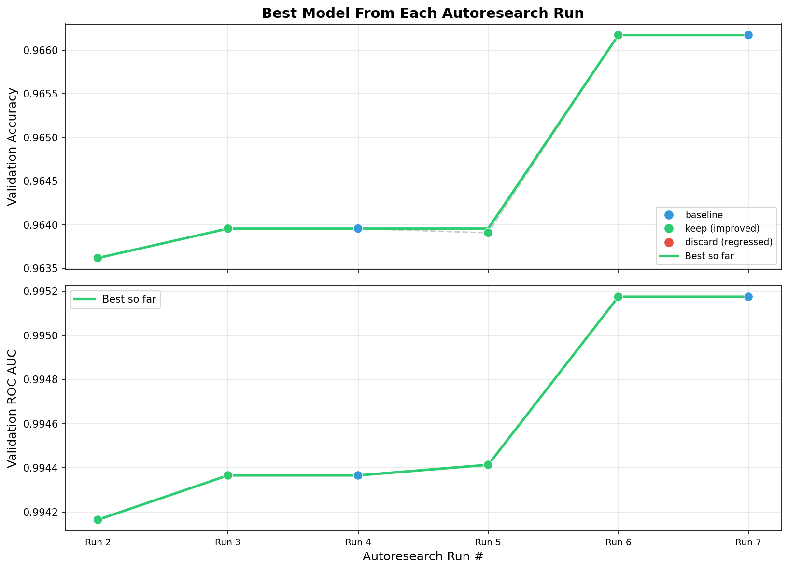

# Airline Passenger Satisfaction Prediction

## Overview
This project aims to predict airline passenger satisfaction (classified as either 'satisfied' or 'neutral/dissatisfied') using the [Airline Passenger Satisfaction dataset](https://www.kaggle.com/datasets/teejmahal20/airline-passenger-satisfaction) from Kaggle. 

The primary objective of this repository is to build and evaluate predictive models entirely in Python, with the ultimate success criteria being the implementation of an autoresearch agent designed specifically to outperform manually tuned baseline machine learning models.

## Project Structure
Below is a description of the core directories and configuration files in this repository:

- `data/raw/`: Raw Kaggle source files kept as the original download reference.
- `data/`: The working train/test data used by this project after resplitting for reproducibility and consistent experiments.
- `scripts/`: Supporting notebook-style workflow for the data split and baseline modeling work that established the initial benchmark.
- `model.py`: The current editable autoresearch model definition used for customer satisfaction prediction.
- `prepare.py`: Shared experiment utilities for loading data, creating the validation split, evaluating models, logging results, and plotting performance.
- `run.py`: Runs a single labeled autoresearch experiment against the current `model.py`.
- `demo.py`: Runs the multi-iteration autoresearch demonstration loop and writes the latest run to `results.tsv`.
- `program.md`: The high-level instructions and constraints for the autoresearch workflow.
- `results.tsv`: The latest run-level experiment log used to generate the current performance plot.
- `performance.png`: The latest visualization generated from `results.tsv`.

## Experiment Log

Track the performance of manual baseline models against the automated research runs below. We use `ROC AUC` as the primary model-selection metric throughout autoresearch; `accuracy` is included as a secondary metric for easier side-by-side viewing.

| Model Type | Creator (User / Autoresearch) | Autoresearch Run # | Runtime (s) | ROC AUC | Accuracy | Preserved/Deleted | Notes |
| :--- | :--- | :--- | :--- | :--- | :--- | :--- | :--- |
| Logistic Regression | User | | 3.2949 seconds |0.9197 | NA* | Preserved | Baseline with minimal preprocessing. Max iterations set to 1000. |
| Logistic Regression | Autoresearch | 1| 0.31 seconds |0.9295 | NA* | Preserved | Iteration 1 baseline via `run.py`; used updated classification scaffold on `data/train.csv` with one-hot encoding and median/mode imputation. |
| Random Forest | Autoresearch |1| 13.27 seconds |0.9920 | NA* | Preserved | Iteration 2 kept. Switched `model.py` to `RandomForestClassifier(n_estimators=300, max_depth=12, min_samples_leaf=2)` and adjusted to single-thread execution because sandboxed multiprocessing was blocked. |
| Logistic Regression | Autoresearch |2| 0.24 seconds |0.9295 | 0.8748 | Preserved | 8-iteration run exp-001 baseline from `demo.py`. |
| Logistic Regression Balanced | Autoresearch |2| 0.24 seconds |0.9294 | 0.8691 | Deleted | 8-iteration run exp-002 discarded. `class_weight='balanced'` slightly reduced ROC AUC. |
| Logistic Regression C=0.5 | Autoresearch |2|0.23 seconds |0.9295 | 0.8749 | Deleted | 8-iteration run exp-003 discarded. Essentially tied baseline on ROC AUC. |
| Random Forest | Autoresearch |2|15.27 seconds |0.9920 | 0.9539 | Preserved | 8-iteration run exp-004 kept. `n_estimators=300`, `max_depth=12`, `min_samples_leaf=2`, `n_jobs=1`. |
| Random Forest Full Depth | Autoresearch |2|30.38 seconds |0.9942 | 0.9636 | Preserved | 8-iteration run exp-005 kept and became best overall. `n_estimators=500`, full depth, single-threaded for sandbox safety. |
| Extra Trees | Autoresearch |2|15.57 seconds |0.9924 | 0.9563 | Deleted | 8-iteration run exp-006 discarded. Strong result but below best random forest. |
| Gradient Boosting | Autoresearch |2|27.41 seconds |0.9909 | 0.9523 | Deleted | 8-iteration run exp-007 discarded. Lower ROC AUC than the current best. |
| Extra Trees Full Depth | Autoresearch |2|27.25 seconds |0.9934 | 0.9632 | Deleted | 8-iteration run exp-008 discarded. Close, but still below exp-005. |

\* Accuracy values for the first three logged rows were not preserved because this column was added after those earlier runs had already been documented.

## Latest Performance Plot

